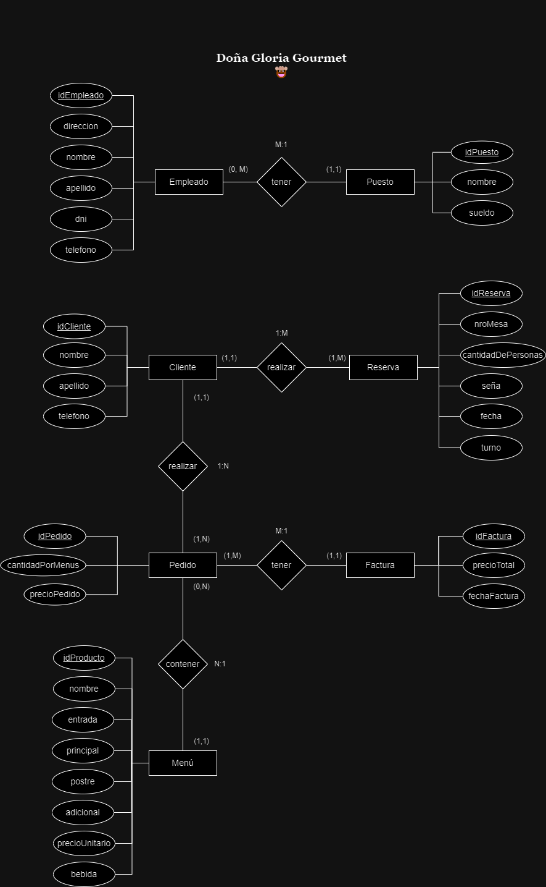
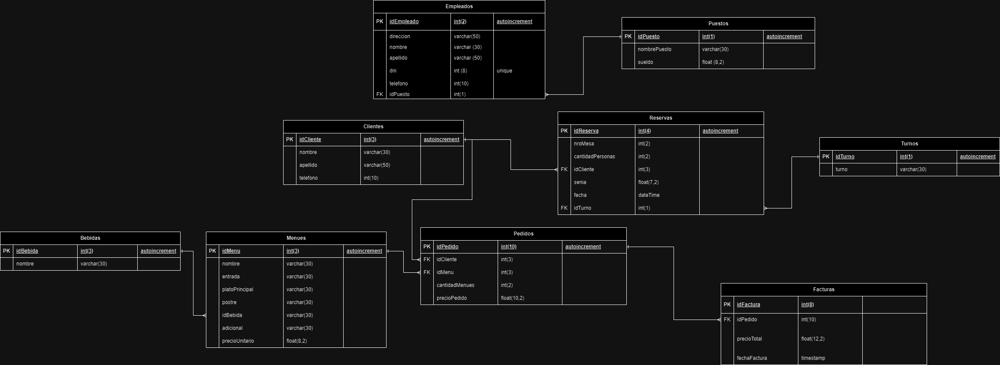

# *Doña Gloria Gourmet*


*El presente repositorio, hace alusión a una tarea realizada en la materia administración de base de datos de la tecnicatura de desarrollo de software del instituto IFTS18.*


## *Información de la materia*
**_Nombre del grupo:_** *Miluteam*

**_Profesor:_** *Emanuel Alejandro Odstrcil*

**_Cuatrimestre:_** *1°*

**_Año:_** *2024*

**_Institución:_** *IFTS 18* 


## *Autores*

:wine_glass: [@Jorge Nadir Adad](https://github.com/nadiradad)

:spaghetti: [@Pablo García Ferré](https://github.com/Pgarfer08)

:fork_and_knife: [@Tomás Edelcopp](https://github.com/tedelcopp)

:coffee: [@Milagros Belén Llanos](https://github.com/moonstone3798)

:pancakes: [@Martín Emiliano Paz](https://github.com/Martho1587)

:poultry_leg: [@Tatiana Pinzón Rodríguez](https://github.com/TatianaPinzonR)

:meat_on_bone: [@Brian Pitz](https://github.com/ElYabran)


## *El proyecto*
*Nuestro cliente, Doña Gloria Gourmet, es un restaurant de categoría. El cual nos ha encomendado la realización de la base de datos, que utilizaran para desarrollar el software de gestión del mismo.* 


## *Diagrama de entidad relación*




## *Diagrama de tablas*




## *Restricciones propuestas por el cliente*
* *una reserva por cliente en el día* 
* *como máximo por reserva 10 personas*
* *cada reserva debe poseer una seña*


## *Reportes solicitados por el cliente*
* *Listado de los dos menues más consumidos* 
```
SELECT m.nombre,SUM(p.cantidadMenues) AS "cantidad de veces consumidos"
FROM pedidos p
INNER JOIN menues m ON p.idMenu = m.idMenu
GROUP BY m.idMenu
ORDER BY m.nombre ASC
LIMIT 2;
```
* *Dias de la semana donde hay mayor N° reservas*
SELECT DAYNAME(r.fecha) AS dia -- , COUNT(r.idReserva) AS "cantidad de reservas por dia"
FROM reservas r
GROUP BY DAYNAME(r.fecha)
ORDER BY COUNT(r.idReserva) DESC


* *Consumidor con mayor cantidad de reservas*
SELECT c.idCliente, c.nombre, c.apellido, COUNT(r.idReserva) AS totalReservas
FROM Clientes c
JOIN Reservas r ON c.idCliente = r.idCliente
GROUP BY c.idCliente, c.nombre, c.apellido
ORDER BY totalReservas DESC
LIMIT 1;

* *Obtener cual es la comida y la bebida que se pidió en el pedido n° 2*
SELECT p.idPedido, m.nombre AS nombreMenu, b.nombre AS nombreBebida
FROM Pedidos p
JOIN Menues m ON p.idMenu = m.idMenu
JOIN Bebidas b ON m.idBebida = b.idBebida
WHERE p.idPedido = 2;

* *El cliente con la factura más cara*
SELECT c.nombre, c.apellido ,MAX(precioTotal) AS "precio total de la factura"
FROM facturas f
INNER JOIN pedidos p ON f.idPedido = p.idPedido
INNER JOIN clientes c ON p.idCliente = c.idCliente
